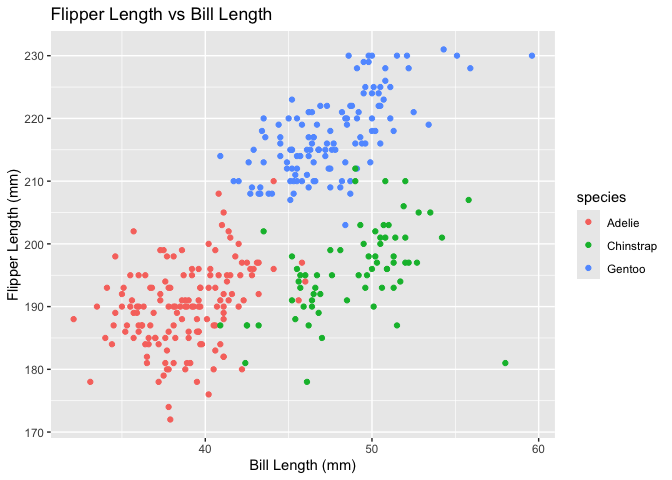

p8105_hw1_tc3326
================
KK Chen
2024-09-21

## Problem 1

Load the penguins dataset

``` r
data("penguins", package = "palmerpenguins")
```

Write a short description of the penguins dataset

``` r
summary(penguins)
```

    ##       species          island    bill_length_mm  bill_depth_mm  
    ##  Adelie   :152   Biscoe   :168   Min.   :32.10   Min.   :13.10  
    ##  Chinstrap: 68   Dream    :124   1st Qu.:39.23   1st Qu.:15.60  
    ##  Gentoo   :124   Torgersen: 52   Median :44.45   Median :17.30  
    ##                                  Mean   :43.92   Mean   :17.15  
    ##                                  3rd Qu.:48.50   3rd Qu.:18.70  
    ##                                  Max.   :59.60   Max.   :21.50  
    ##                                  NA's   :2       NA's   :2      
    ##  flipper_length_mm  body_mass_g       sex           year     
    ##  Min.   :172.0     Min.   :2700   female:165   Min.   :2007  
    ##  1st Qu.:190.0     1st Qu.:3550   male  :168   1st Qu.:2007  
    ##  Median :197.0     Median :4050   NA's  : 11   Median :2008  
    ##  Mean   :200.9     Mean   :4202                Mean   :2008  
    ##  3rd Qu.:213.0     3rd Qu.:4750                3rd Qu.:2009  
    ##  Max.   :231.0     Max.   :6300                Max.   :2009  
    ##  NA's   :2         NA's   :2

- Important variables in this `penguins` dataset include
  **species**(Adelie, Chinstrap, and Gentoo), **island** names (Biscoe,
  Dream, Torgersen), **bill length** (ranging from 32.1 mm to 59.6 mm),
  **bill depth**, **flipper length** (mean: 200.9152047 mm), **body
  mass**, **sex**, and **year** of observation. These important
  variables’ values can be found on the above table. The dataset
  includes 344 rows and 8 columns.

Make a scatterplot of flipper length vs bill length

``` r
library(ggplot2)

ggplot(penguins, aes(x = bill_length_mm, y = flipper_length_mm, color = species)) +
  geom_point() +
  labs(title = "Flipper Length vs Bill Length", x = "Bill Length (mm)", y = "Flipper Length (mm)")
```

    ## Warning: Removed 2 rows containing missing values or values outside the scale range
    ## (`geom_point()`).

<!-- -->

``` r
ggsave("scatterplot_flipper_vs_bill.jpg", width = 4, height = 6)
```

    ## Warning: Removed 2 rows containing missing values or values outside the scale range
    ## (`geom_point()`).
